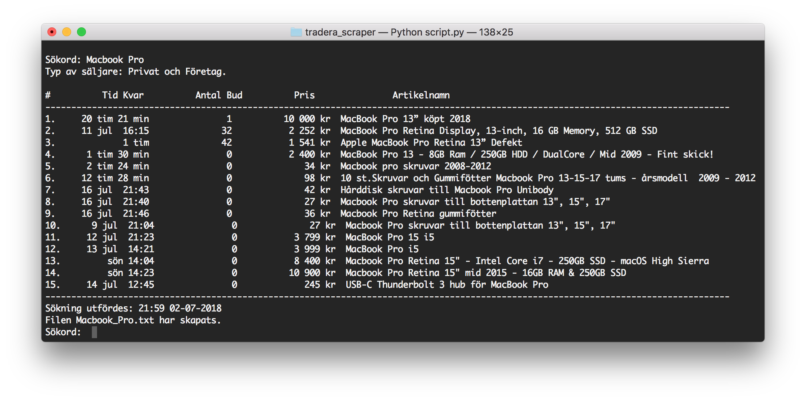

# Tradera Scraper

A tool for scraping information from Tradera.se product pages given a specific search query. 
The script uses BeautifulSoup 4.4 and Python 2.7 to scrape the data.

Adding on a feature to collect all the searches in specific text files and then be able to search, sort, compare, ...,  them. 

## Screenshots

 Search word 'Macbook Pro'.

    

